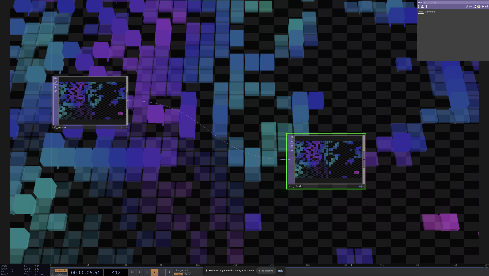
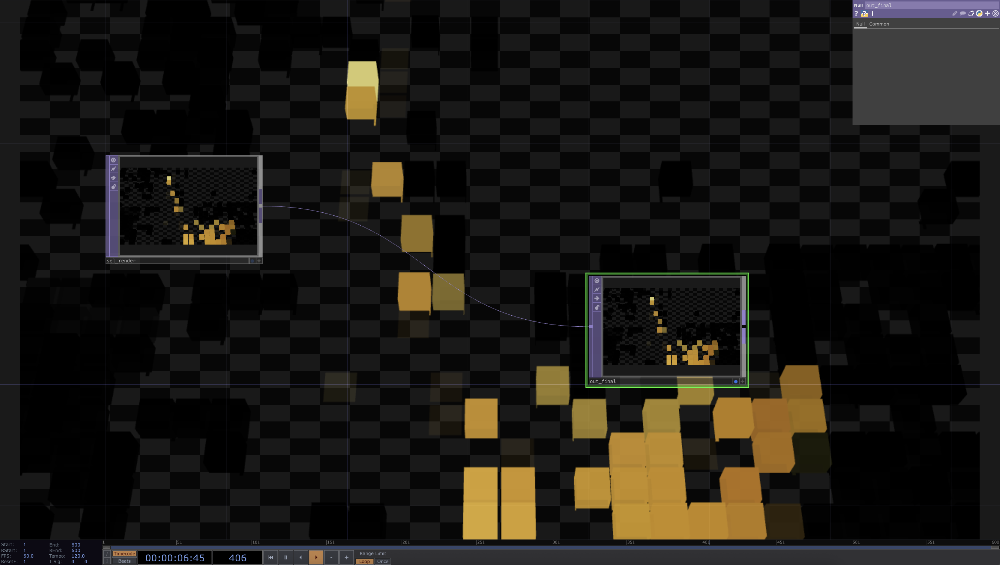
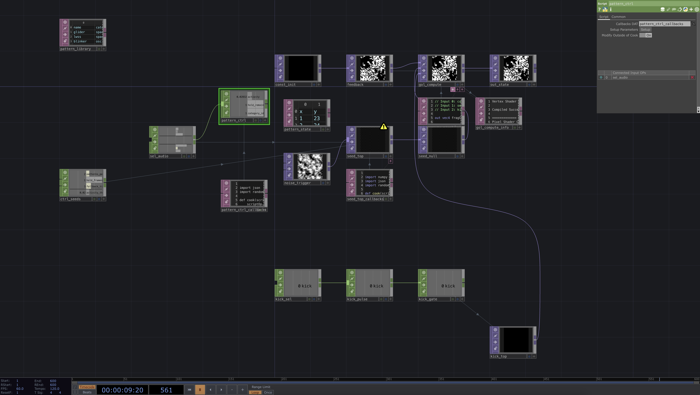
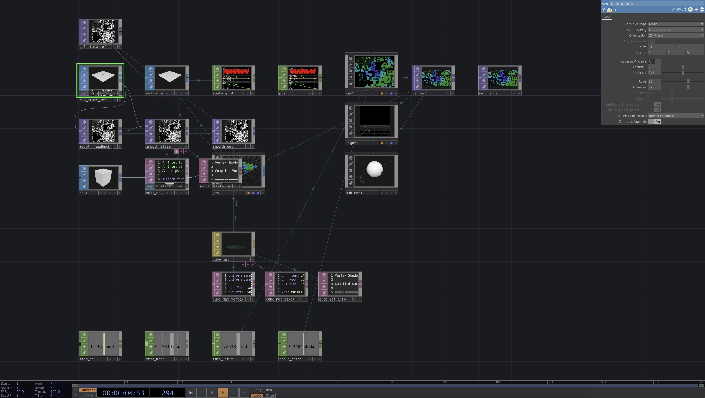
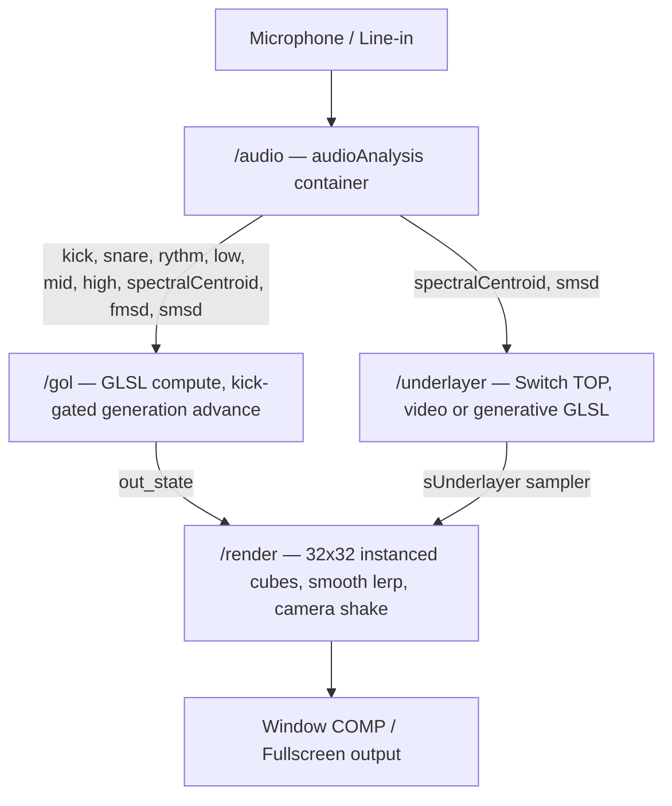

# Audio-Reactive Game of Life — TouchDesigner

A live-performance visual system built in TouchDesigner. A 32×32 grid of 3D cubes simulates **Conway's Game of Life**, driven by real-time audio analysis. The simulation evolves on every kick hit — alive cells rise and reveal a colourful underlayer, dead cells sink into the dark.

---

## How It Works

**Audio drives everything.** Live input is split into frequency bands and analyzed for transients:

- **Kick** — advances the simulation one generation and injects new alive cells proportional to bass, mid, and treble energy. Also stamps structured GoL patterns (gliders, oscillators, methuselahs) at random grid positions.
- **Snare** — independently injects oscillator patterns into a frozen grid.
- **Rythm** — seeds a random 16×16 quadrant at ~50% density for a burst of activity.
- **Spectral centroid** — shifts the hue of the generative underlayer colour field.
- **Transient energy (fmsd)** — drives camera shake on hard hits.

Between kicks the grid is completely frozen — it only evolves on the beat.

---

## Visual Output

Alive cells render as tall, opaque cubes displaying the colour of the underlayer beneath them. Dead cells are invisible, leaving the grid dark. Transitions between states are smoothly animated via a per-frame lerp shader.

The underlayer is switchable at runtime between:
- **Video / media** — any image or video clip
- **Generative GLSL** — animated Perlin noise with audio-driven hue and speed

| Generative underlayer (noise shader) | Video underlayer (banana) |
|---|---|
|  |  |

---

## TouchDesigner Network

The project is split into focused base COMPs:

### `/gol` — Game of Life Simulation

GLSL pixel shader where one pixel = one cell. The state texture feeds back through a `Feedback TOP`. Seeding is handled by a `Script TOP` that responds to kick, snare, and rythm pulses. A pattern library DAT holds 8 canonical GoL patterns encoded as cell-coordinate offsets.

### `/render` — Instanced Cube Grid + Camera

1024 cubes rendered via geometry instancing — no per-instance COMPs. A smooth lerp chain (`smooth_state` GLSL TOP) interpolates the raw binary GoL state at 0.15/frame for fluid visual transitions. Camera shake is driven by fast transient energy via a dedicated CHOP chain.

### `/underlayer` — Switchable Background Source

A `Switch TOP` toggles between a `Movie File In TOP` and a `GLSL TOP` Perlin noise shader. The noise shader receives `spectralCentroid` and `smsd` from audio analysis via `choptoTOP` textures, modulating hue and animation speed in real time.

---

## Architecture

---

## Performance

- Target: stable **60 FPS** on a standard performance laptop
- GoL compute runs entirely on GPU via GLSL TOP
- Geometry instancing avoids 1024 individual COMPs
- Smooth state lerp and seed injection also GPU-side
