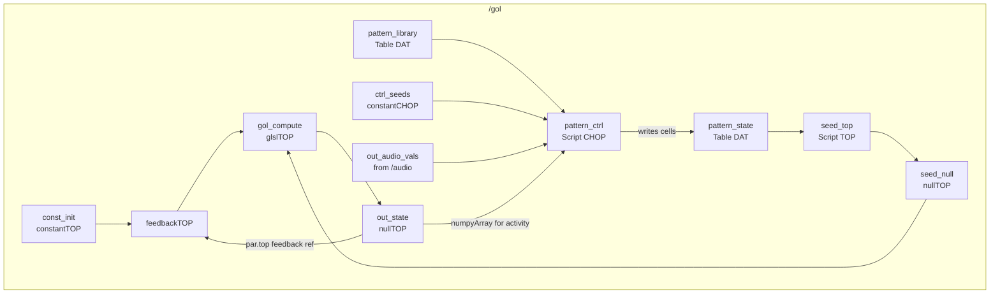
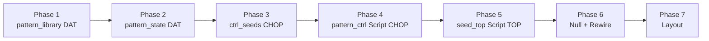

# Implementation Plan — GoL Pattern Seed Library

**Date**: 2026-05-25  
**Scope**: Replace `/gol/seed_injector` with a pattern-library-driven seed system  
**Reference**: `documentation/gol-seeds.md` (design decisions)

> **Implementation status**: Built — see `implementation-report.md` (Phase 9) for deviations.  
> Key difference from this plan: all seeding logic was consolidated into `seed_top` (Script TOP) rather than split across `pattern_ctrl` → `pattern_state` → `seed_top`. Frequency-band seeding was also re-enabled inside `seed_top`.

---

## Summary of Changes

| Action | Operator | Reason |
|---|---|---|
| Remove | `seed_injector` (glslTOP) | Replaced by Script TOP |
| Add | `pattern_library` (Table DAT) | Encodes all known patterns |
| Add | `pattern_state` (Table DAT) | Holds active cells for current injection frame(s) |
| Add | `ctrl_seeds` (constantCHOP) | Runtime-tunable parameters |
| Add | `activity_chop` — folded into `pattern_ctrl` | Avoid extra operator |
| Add | `pattern_ctrl` (Script CHOP) | All picker logic + activity monitor |
| Add | `seed_top` (Script TOP) | Renders `pattern_state` to 32×32 texture |
| Add | `seed_null` (nullTOP) | Output boundary → `gol_compute` input 1 |
| Rewire | `gol_compute` input 1 | From `seed_injector` → `seed_null` |

Net: +6 operators, −1 operator.

---

## Updated `/gol` Network



---

## Phase 1 — Pattern Library DAT

Create `pattern_library` Table DAT inside `/gol` with columns: `name`, `category`, `cells`.

`cells` is a JSON array of `[x, y]` offsets relative to local origin `[0, 0]`.

| name | category | cells |
|---|---|---|
| glider | spaceship | `[[1,0],[2,1],[0,2],[1,2],[2,2]]` |
| lwss | spaceship | `[[0,0],[2,0],[3,1],[3,2],[0,2],[1,2],[2,2]]` |
| blinker | oscillator | `[[0,0],[1,0],[2,0]]` |
| toad | oscillator | `[[1,0],[2,0],[3,0],[0,1],[1,1],[2,1]]` |
| beacon | oscillator | `[[0,0],[1,0],[0,1],[1,1],[2,2],[3,2],[2,3],[3,3]]` |
| pulsar | oscillator | `[[2,0],[3,0],[4,0],[8,0],[9,0],[10,0],[0,2],[5,2],[7,2],[12,2],[0,3],[5,3],[7,3],[12,3],[0,4],[5,4],[7,4],[12,4],[2,5],[3,5],[4,5],[8,5],[9,5],[10,5],[2,7],[3,7],[4,7],[8,7],[9,7],[10,7],[0,8],[5,8],[7,8],[12,8],[0,9],[5,9],[7,9],[12,9],[0,10],[5,10],[7,10],[12,10],[2,12],[3,12],[4,12],[8,12],[9,12],[10,12]]` |
| r_pentomino | methuselah | `[[1,0],[0,1],[1,1],[1,2],[2,2]]` |
| acorn | methuselah | `[[1,0],[3,1],[0,2],[1,2],[3,2],[4,2],[5,2]]` |

**Python to create and populate:**

```python
gol = op('/project1/gol')
lib = op.TDAPI.CreateOp(gol, tableDat, 'pattern_library')
lib.viewer = True

import json
patterns = [
    ('glider',      'spaceship',  [[1,0],[2,1],[0,2],[1,2],[2,2]]),
    ('lwss',        'spaceship',  [[0,0],[2,0],[3,1],[3,2],[0,2],[1,2],[2,2]]),
    ('blinker',     'oscillator', [[0,0],[1,0],[2,0]]),
    ('toad',        'oscillator', [[1,0],[2,0],[3,0],[0,1],[1,1],[2,1]]),
    ('beacon',      'oscillator', [[0,0],[1,0],[0,1],[1,1],[2,2],[3,2],[2,3],[3,3]]),
    ('pulsar',      'oscillator', [[2,0],[3,0],[4,0],[8,0],[9,0],[10,0],[0,2],[5,2],[7,2],[12,2],[0,3],[5,3],[7,3],[12,3],[0,4],[5,4],[7,4],[12,4],[2,5],[3,5],[4,5],[8,5],[9,5],[10,5],[2,7],[3,7],[4,7],[8,7],[9,7],[10,7],[0,8],[5,8],[7,8],[12,8],[0,9],[5,9],[7,9],[12,9],[0,10],[5,10],[7,10],[12,10],[2,12],[3,12],[4,12],[8,12],[9,12],[10,12]]),
    ('r_pentomino', 'methuselah', [[1,0],[0,1],[1,1],[1,2],[2,2]]),
    ('acorn',       'methuselah', [[1,0],[3,1],[0,2],[1,2],[3,2],[4,2],[5,2]]),
]

lib.clear()
lib.appendRow(['name', 'category', 'cells'])
for name, cat, cells in patterns:
    lib.appendRow([name, cat, json.dumps(cells)])
```

---

## Phase 2 — Pattern State DAT

Empty table, updated every injection by `pattern_ctrl`. Columns: `x`, `y`.

```python
ps = op.TDAPI.CreateOp(gol, tableDat, 'pattern_state')
ps.viewer = True
ps.clear()
ps.appendRow(['x', 'y'])
```

---

## Phase 3 — Control Parameters (`ctrl_seeds` constantCHOP)

Four runtime-tunable channels. All read by `pattern_ctrl`.

```python
ctrl = op.TDAPI.CreateOp(gol, constantCHOP, 'ctrl_seeds')
ctrl.viewer = True

ctrl.par.name0  = 'patterns_per_beat';   ctrl.par.value0 = 1
ctrl.par.name1  = 'hold_frames';         ctrl.par.value1 = 1
ctrl.par.name2  = 'fallback_timeout';    ctrl.par.value2 = 3.0
ctrl.par.name3  = 'activity_threshold';  ctrl.par.value3 = 0.05
```

| Channel | Default | Effect |
|---|---|---|
| `patterns_per_beat` | 1 | How many patterns stamped per beat event |
| `hold_frames` | 1 | Frames the seed texture stays forced-alive |
| `fallback_timeout` | 3.0 s | Seconds without a beat before random scatter fires |
| `activity_threshold` | 0.05 | Fraction of alive cells below which methuselah auto-injects |

---

## Phase 4 — Pattern Controller (`pattern_ctrl` Script CHOP)

This is the core logic operator. It reads beat + grid activity every frame and manages all injection decisions.

**Inputs**: connect `out_audio_vals` CHOP as input 0 (makes it time-dependent → cooks every frame).

**Side effects**: writes to `pattern_state` Table DAT.

**Output channels**: `activity`, `hold_remaining`, `category_idx` (for monitoring/debugging in TD network editor).

**State** is persisted across frames using `scriptOp.store` / `scriptOp.fetch`.

```python
# Create the Script CHOP
pc = op.TDAPI.CreateOp(gol, scriptCHOP, 'pattern_ctrl')
pc.viewer = True
pc.inputConnectors[0].connect(op('/project1/audio/out_audio_vals'))
```

**Script content** (set via `pc.par.callbacks` or the DAT linked to the Script CHOP):

```python
import json
import random

# Called once when the CHOP is first created
def setupParameters(scriptOp):
    pass

def cook(scriptOp):
    scriptOp.clear()

    # ── Operator references ──────────────────────────────────────────
    gol_state     = op('/project1/gol/out_state')
    pattern_lib   = op('/project1/gol/pattern_library')
    pattern_state = op('/project1/gol/pattern_state')
    ctrl          = op('/project1/gol/ctrl_seeds')

    # ── Parameters ───────────────────────────────────────────────────
    patterns_per_beat    = max(1, int(ctrl.chan('patterns_per_beat')[0]))
    hold_frames          = max(1, int(ctrl.chan('hold_frames')[0]))
    fallback_timeout     = float(ctrl.chan('fallback_timeout')[0])
    activity_threshold   = float(ctrl.chan('activity_threshold')[0])

    # ── Grid activity (fraction of alive cells) ───────────────────────
    arr = gol_state.numpyArray()
    activity = float(arr[:, :, 0].mean()) if arr is not None else 0.0

    # ── Audio beat channel ────────────────────────────────────────────
    beat_ch = scriptOp.inputs[0].chan('beat') if scriptOp.inputs else None
    beat    = float(beat_ch[0]) if beat_ch else 0.0

    # ── Persistent state ──────────────────────────────────────────────
    prev_beat      = scriptOp.fetch('prev_beat',      0.0)
    hold_remaining = scriptOp.fetch('hold_remaining', 0)
    category_idx   = scriptOp.fetch('category_idx',   0)   # 0=spaceship 1=oscillator 2=methuselah
    fallback_timer = scriptOp.fetch('fallback_timer',  0.0)

    CATEGORIES = ['spaceship', 'oscillator', 'methuselah']
    beat_rising = (prev_beat < 0.5 and beat >= 0.5)

    # ── Determine injection trigger ───────────────────────────────────
    inject_category = None
    inject_count    = patterns_per_beat
    do_random_scatter = False

    if beat_rising:
        inject_category = CATEGORIES[category_idx % len(CATEGORIES)]
        category_idx    = (category_idx + 1) % len(CATEGORIES)
        fallback_timer  = 0.0

    elif activity < activity_threshold:
        # Low-activity auto-trigger: methuselahs only, 1 pattern
        inject_category = 'methuselah'
        inject_count    = 1

    else:
        # Advance fallback timer
        fallback_timer += op('/project1/gol').time.deltaTime
        if fallback_timer >= fallback_timeout:
            do_random_scatter = True
            fallback_timer    = 0.0

    # ── Build cell list ───────────────────────────────────────────────
    new_cells = []   # list of (x, y) absolute grid positions

    if do_random_scatter:
        # Fallback: ~15% random cells across the entire grid
        new_cells = [
            (x, y)
            for x in range(32) for y in range(32)
            if random.random() < 0.15
        ]

    elif inject_category is not None:
        # Gather patterns of the chosen category from the library
        lib_patterns = []
        for r in range(1, pattern_lib.numRows):
            if pattern_lib[r, 'category'] == inject_category:
                cells = json.loads(str(pattern_lib[r, 'cells']))
                lib_patterns.append(cells)

        if lib_patterns:
            for _ in range(inject_count):
                cells = random.choice(lib_patterns)
                xs = [c[0] for c in cells]
                ys = [c[1] for c in cells]
                # Clamp offset so pattern fits within 32x32
                max_ox = max(0, 31 - max(xs))
                max_oy = max(0, 31 - max(ys))
                ox = random.randint(0, max_ox)
                oy = random.randint(0, max_oy)
                new_cells.extend([(c[0] + ox, c[1] + oy) for c in cells])

    # ── Write to pattern_state DAT ────────────────────────────────────
    if new_cells:
        pattern_state.clear()
        pattern_state.appendRow(['x', 'y'])
        for x, y in new_cells:
            pattern_state.appendRow([x, y])
        hold_remaining = hold_frames

    elif hold_remaining > 0:
        hold_remaining -= 1
        if hold_remaining == 0:
            pattern_state.clear()
            pattern_state.appendRow(['x', 'y'])

    # ── Save state ────────────────────────────────────────────────────
    scriptOp.store('prev_beat',      beat)
    scriptOp.store('hold_remaining', hold_remaining)
    scriptOp.store('category_idx',   category_idx)
    scriptOp.store('fallback_timer', fallback_timer)

    # ── Output monitoring channels ────────────────────────────────────
    scriptOp.appendChan('activity')[0]      = activity
    scriptOp.appendChan('hold_remaining')[0] = float(hold_remaining)
    scriptOp.appendChan('category_idx')[0]  = float(category_idx)
```

---

## Phase 5 — Seed Texture (`seed_top` Script TOP)

Reads `pattern_state` DAT each frame, renders a 32×32 float texture with alive pixels at the listed coordinates. Replaces `seed_injector`.

```python
st = op.TDAPI.CreateOp(gol, scriptTOP, 'seed_top')
st.viewer = True
st.par.format        = 'r32f'
st.par.resolutionw   = 32
st.par.resolutionh   = 32
```

**Script content:**

```python
import numpy as np

def cook(scriptOp):
    pattern_state = op('/project1/gol/pattern_state')

    arr = np.zeros((32, 32, 4), dtype=np.float32)

    # Skip header row (row 0)
    for r in range(1, pattern_state.numRows):
        try:
            x = int(pattern_state[r, 'x'])
            y = int(pattern_state[r, 'y'])
            if 0 <= x < 32 and 0 <= y < 32:
                arr[y, x, 0] = 1.0
                arr[y, x, 3] = 1.0
        except (ValueError, TypeError):
            pass

    scriptOp.copyNumpyArray(arr)
```

> **Note on Y-flip**: verified — no flip needed. `gol_compute` uses `texelFetch` with y=0 at bottom (OpenGL convention); `copyNumpyArray` row 0 also maps to texture bottom. `arr[y, x]` aligns directly with `texelFetch` coord `(x, y)`.

---

## Phase 6 — Null Output + Rewire

```python
# Null output for seed texture
sn = op.TDAPI.CreateOp(gol, nullTOP, 'seed_null')
sn.viewer = True
sn.inputConnectors[0].connect(op('/project1/gol/seed_top'))

# Rewire gol_compute input 1
gol_compute = op('/project1/gol/gol_compute')
gol_compute.inputConnectors[1].disconnect()
gol_compute.inputConnectors[1].connect(op('/project1/gol/seed_null'))

# Remove old seed_injector
op('/project1/gol/seed_injector').destroy()
```

---

## Phase 7 — Layout

Position new operators to the left of `gol_compute` to keep the network readable:

```
pattern_library  →  (read by pattern_ctrl)
ctrl_seeds       →  pattern_ctrl  →  (writes pattern_state)
out_audio_vals   →  pattern_ctrl
                     pattern_state  →  seed_top  →  seed_null  →  gol_compute input 1
```

---

## Build Order



Each phase can be verified independently:
- **Phase 1–2**: inspect DATs in viewer — library should have 8 rows, state should have header only
- **Phase 3**: verify 4 channels visible in `ctrl_seeds` viewer
- **Phase 4**: after connecting to audio, trigger a beat (or temporarily set `beat` channel to 1.0) — verify `pattern_state` populates with cell coordinates; verify `activity`, `hold_remaining`, `category_idx` channels appear in `pattern_ctrl`
- **Phase 5**: after Phase 4 populates `pattern_state`, verify `seed_top` shows white pixels at the correct grid positions (view at 32×32 in TD)
- **Phase 6**: verify `gol_compute` now receives the pattern texture on input 1; verify GoL evolves from injected patterns

---

## Runtime Controls

After implementation, these are the live-tunable parameters:

| Operator | Channel / Par | Effect |
|---|---|---|
| `/gol/ctrl_seeds` | `patterns_per_beat` | Patterns stamped per beat (1–4) |
| `/gol/ctrl_seeds` | `hold_frames` | Frames seed stays forced alive |
| `/gol/ctrl_seeds` | `fallback_timeout` | Seconds before random scatter fires |
| `/gol/ctrl_seeds` | `activity_threshold` | Alive % below which methuselah auto-injects |

---

## Open Questions

*All verified live in TouchDesigner — 2026-05-25*

- [x] **`scriptOp.store` / `scriptOp.fetch` API** — confirmed available. `store('key', val)` / `fetch('key', default)` work correctly on Script CHOPs in this build. No workaround needed.

- [x] **`copyNumpyArray` float32 RGBA** — method confirmed to exist on Script TOP instances. The "Expected locked operator" error only appears when calling it outside `onCook` (expected TD behavior). Float32 RGBA format is safe to use; no fallback to `r8` / uint8 needed.

- [x] **Y-flip** — verified by reading `/project1/gol/gol_compute_pixel`. The shader derives cell coordinates as:
  ```glsl
  ivec2 coord = ivec2(vUV.st * vec2(32.0, 32.0));
  ```
  `vUV.t = 0` is the bottom of the texture in TD's OpenGL convention. `texelFetch` also uses y=0 at bottom. Therefore:
  - Pattern cell `(x, y)` in `pattern_state` should map to `arr[y, x]` in numpy — **no flip needed** if `copyNumpyArray` row 0 = texture bottom.
  - The `31 - y` inversion in Phase 5 should be **removed**. Use `arr[y, x, 0] = 1.0` directly.
  - Note: visual orientation of patterns (e.g. glider moving "up" vs "down") does not affect GoL correctness — only matters aesthetically. If patterns appear mirrored after implementation, add the flip back at that point.
