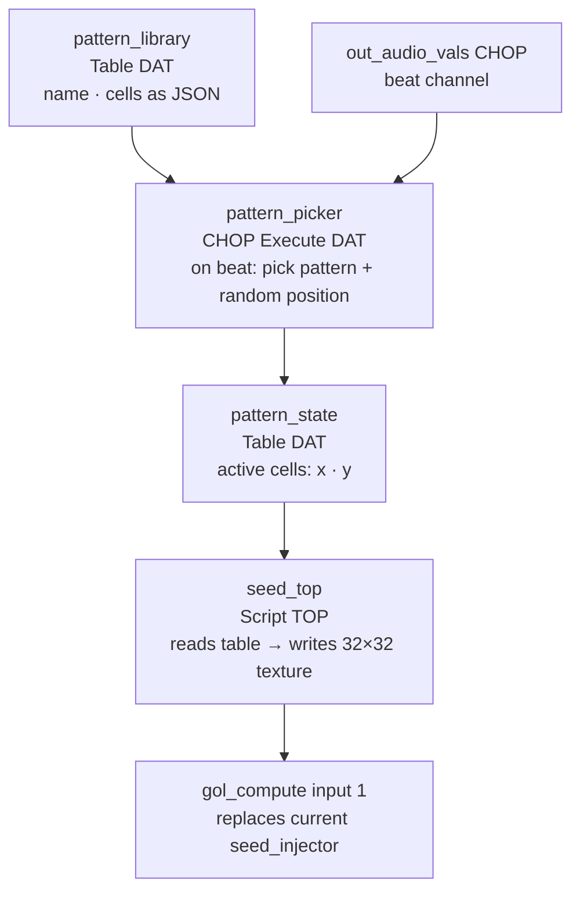

# GoL Seed Pattern Library

**Date**: 2026-05-25  
**Context**: Planning for pattern-based seed injection to replace random-scatter seeding in `/gol/seed_injector`

---

## Pattern Research

Patterns fall into 3 categories relevant to continuous infinite execution:

### Methuselahs
Small seeds that run for hundreds/thousands of generations before stabilizing. Best for injecting bursts of long-lasting activity into a dying grid.

| Name | Cells | Bbox | Lifespan | Notes |
|---|---|---|---|---|
| R-pentomino | 5 | 3×3 | 1103 generations | Produces 6 escaping gliders |
| Acorn | 7 | 6×3 | 5206 generations | Produces 13 escaping gliders; peak pop 1057 |

**Cell coordinates:**

```
R-pentomino:
[[1,0],[0,1],[1,1],[1,2],[2,2]]

Acorn:
[[1,0],[3,1],[0,2],[1,2],[3,2],[4,2],[5,2]]
```

### Oscillators
Repeat forever without dying. Anchor continuous low-level activity.

| Name | Cells | Bbox | Period | Notes |
|---|---|---|---|---|
| Blinker | 3 | 3×1 | 2 | Simplest oscillator |
| Toad | 6 | 4×2 | 2 | |
| Beacon | 8 | 4×4 | 2 | Two offset 2×2 blocks |
| Pulsar | 48 | 13×13 | 3 | Most visually dramatic |

**Cell coordinates:**

```
Blinker:
[[0,0],[1,0],[2,0]]

Toad:
[[1,0],[2,0],[3,0],[0,1],[1,1],[2,1]]

Beacon:
[[0,0],[1,0],[0,1],[1,1],[2,2],[3,2],[2,3],[3,3]]

Pulsar:
[[2,0],[3,0],[4,0],[8,0],[9,0],[10,0],
 [0,2],[5,2],[7,2],[12,2],
 [0,3],[5,3],[7,3],[12,3],
 [0,4],[5,4],[7,4],[12,4],
 [2,5],[3,5],[4,5],[8,5],[9,5],[10,5],
 [2,7],[3,7],[4,7],[8,7],[9,7],[10,7],
 [0,8],[5,8],[7,8],[12,8],
 [0,9],[5,9],[7,9],[12,9],
 [0,10],[5,10],[7,10],[12,10],
 [2,12],[3,12],[4,12],[8,12],[9,12],[10,12]]
```

### Spaceships
Move across the grid forever, collide with other patterns to spawn new activity.

| Name | Cells | Bbox | Period | Speed | Direction |
|---|---|---|---|---|---|
| Glider | 5 | 3×3 | 4 | c/4 | Diagonal |
| LWSS | 7 | 5×4 | 4 | c/2 | Horizontal |

**Cell coordinates:**

```
Glider:
[[1,0],[2,1],[0,2],[1,2],[2,2]]

LWSS (Lightweight Spaceship):
[[0,0],[2,0],[3,1],[3,2],[0,2],[1,2],[2,2]]
```

---

## Proposed Architecture

Replace the current `seed_injector` GLSL TOP (random-scatter, beat-triggered) with a pattern library picker:



### Components

1. **`pattern_library` Table DAT** — one row per pattern: `name`, `cells` (JSON array of `[x,y]` offsets). ~8 patterns encoded inline.
2. **`pattern_picker` CHOP Execute DAT** — fires on beat rising edge. Picks a random pattern, picks a random `(ox, oy)` placement so the pattern fits inside the 32×32 grid, writes to `pattern_state`.
3. **`pattern_state` Table DAT** — columns `x`, `y`. Updated each beat. Cleared after hold time expires.
4. **`seed_top` Script TOP** — reads `pattern_state`, writes each cell as alive pixel in a 32×32 texture. Replaces `seed_injector`.

---

## Design Decisions

*Answered during planning session — 2026-05-25*

<!-- Q1 -->
### Q1: Replace or supplement random seeding?
**Question**: Should pattern injection replace the current random-scatter seeding entirely, or run in parallel (random scatter + pattern both injected)?

**Answer**: C — Replace with fallback. Stamp patterns on beat; if no pattern fires for N seconds and the grid goes quiet, fall back to a random scatter burst.

---

<!-- Q2 -->
### Q2: Trigger — beat-only or also auto-trigger on low activity?
**Question**: Should a pattern also inject automatically when grid activity drops below a threshold (e.g., < 5% alive cells), independent of the beat? This prevents the grid dying during quiet passages.

**Answer**: C — Beat + threshold, methuselahs only on threshold. Beat trigger picks from the full library randomly; low-activity threshold trigger picks only from methuselahs (R-pentomino, Acorn) to maximize grid recovery.

---

<!-- Q3 -->
### Q3: Single vs. multiple patterns per beat?
**Question**: One pattern per beat pulse, or the option to stamp 2–3 patterns at different positions simultaneously for denser seeding?

**Answer**: D — Configurable parameter on the `/gol` base COMP. Default 1 pattern per beat, adjustable live at runtime.

---

<!-- Q4 -->
### Q4: Pattern hold time
**Question**: Should the seed texture stay "forced alive" for multiple frames (e.g., 3–5) to give the pattern a fighting chance to establish, or is 1 frame sufficient?

**Answer**: C — Configurable parameter on the `/gol` base COMP. Default 1 frame, adjustable live at runtime.

---

<!-- Q5 -->
### Q5: Pattern selection weighting
**Question**: Pure random selection from the library, or weighted — e.g., prefer methuselahs (R-pentomino, Acorn) when the grid is quiet, and oscillators/spaceships when it's already busy?

**Answer**: C — Category rotation. Cycle through categories (spaceship → oscillator → methuselah → ...) on each beat, picking randomly within the current category. Ensures visual variety over time.
