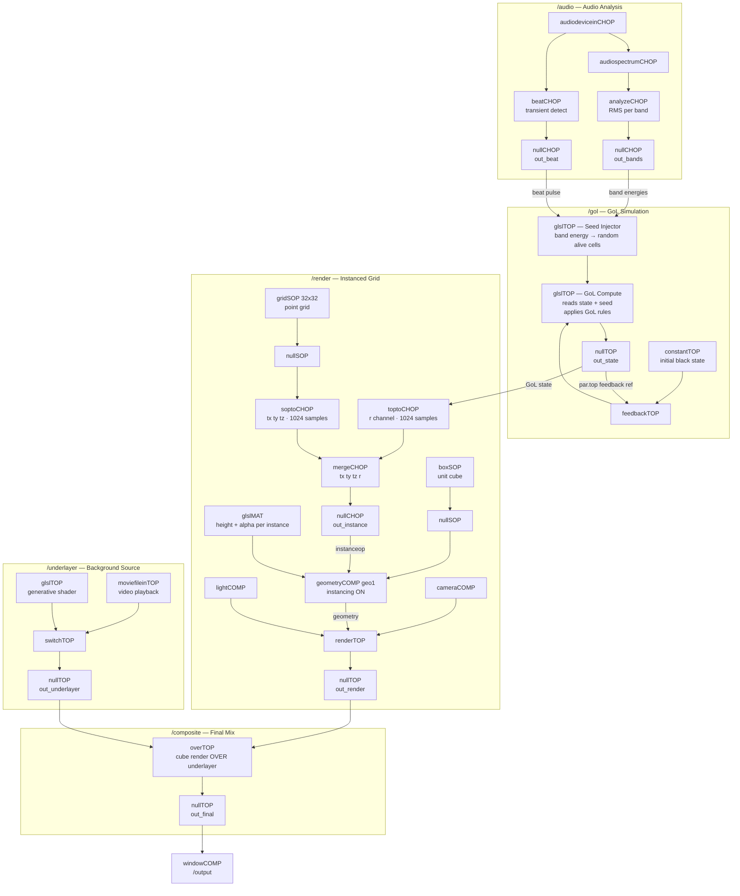
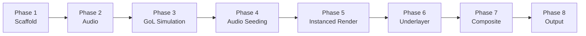

# Implementation Plan — Audio-Reactive Game of Life

**Date**: 2026-05-24

---

## Re-evaluation vs Initial Design

After reviewing the TouchDesigner API reference, several parts of the original architecture were revised:

| Topic | Original Assumption | Corrected Approach |
|---|---|---|
| Grid positions | CHOP → Instance | `gridSOP` → `nullSOP` → `soptoCHOP` gives 1024 `tx/ty/tz` samples — no manual scripting needed |
| GoL state → instance data | Use TOP as `instanceop` directly | `toptoCHOP` converts 32×32 TOP to 1024-sample CHOP; merged with position CHOP into a single instance CHOP |
| Audio seeding | CPU script writes pixels | A dedicated **seed GLSL TOP** reads audio CHOP → produces a sparse alive-cell texture → fed as a second input to the GoL compute shader (stays fully on GPU) |
| GoL compute | Pixel shader | **Compute shader** (`layout local_size 8×8`) is more appropriate; reads state + seed inputs, writes GoL next-state |
| Alpha masking | "composite" over underlayer | Cube render alpha = instance alpha (driven by GoL state `r` channel); `overTOP` composites cube pass over underlayer |
| Geometry creation | Create geometry inside COMP | Create `boxSOP` at parent level, pass via `In/Out SOP` using `CreateGeometryComp` |

---

## Network Overview



---

## Phase Breakdown

### Phase 1 — Project Scaffold

Create the six base COMPs at root (`/project1`):

```
/audio
/gol
/render
/underlayer
/composite
/output
```

**Operators per COMP**: each gets an `inCHOP`/`inTOP` and `outCHOP`/`outTOP` at its boundary so networks are self-contained and portable.

**API calls**:
```python
for name in ['audio', 'gol', 'render', 'underlayer', 'composite', 'output']:
    op.TDAPI.CreateOp(project1, baseCOMP, name)
```

---

### Phase 2 — Audio Analysis (`/audio`)

**Goal**: extract per-band RMS energy and a beat pulse from microphone input.

**Operator chain**:

```
audiodeviceinCHOP
    → audiospectrumCHOP        (FFT, 64+ bins)
    → analyzeCHOP              (RMS, output 1 value per band)
    → nullCHOP  [out_bands]    (bass / mid / treble channels)

audiodeviceinCHOP
    → beatCHOP                 (beat/downbeat detection)
    → nullCHOP  [out_beat]
```

**Key parameters**:
- `audiodeviceinCHOP`: set device to system default or line-in
- `audiospectrumCHOP`: `freqstart=20`, `freqend=20000`, split into 3 named ranges
- `analyzeCHOP`: function = `rms`
- `beatCHOP`: `period` set to expected BPM range (60–180)

**Outputs exposed to other COMPs**:
- `out_bands`: 3 channels (`bass`, `mid`, `treble`), 1 sample each, 0–1 normalized
- `out_beat`: 1 channel (`beat`), pulse on transient

---

### Phase 3 — GoL Simulation (`/gol`)

**Goal**: compute Game of Life generations on the GPU using a 32×32 float texture with a feedback loop.

#### 3a — Feedback loop structure

```
constantTOP (black 32×32)  →  feedbackTOP  →  glslTOP [gol_compute]  →  nullTOP [out_state]
                                   ↑                                           |
                                   └─────────── par.top = 'out_state' ────────┘
```

**Setup**:
```python
# 1. Initial state — black = all cells dead
const_init = CreateOp(gol, constantTOP, 'const_init')
const_init.par.colorr = const_init.par.colorg = const_init.par.colorb = 0
const_init.par.resolutionw = const_init.par.resolutionh = 32

# 2. Feedback TOP
feedback = CreateOp(gol, feedbackTOP, 'feedback')
feedback.inputConnectors[0].connect(const_init)
feedback.par.top = 'out_state'          # Relative path — set AFTER null_out exists

# 3. GoL compute shader
gol_compute = CreateOp(gol, glslTOP, 'gol_compute')
gol_compute.par.format = 'rgba32float'
gol_compute.par.resolutionw = gol_compute.par.resolutionh = 32
gol_compute.inputConnectors[0].connect(feedback)   # input 0 = current state
# input 1 = seed texture (connected in Phase 4)

# 4. Null output
out_state = CreateOp(gol, nullTOP, 'out_state')
out_state.inputConnectors[0].connect(gol_compute)

# 5. Wire feedback reference and reset
feedback.par.top = 'out_state'
feedback.par.resetpulse.pulse()
```

#### 3b — GoL Compute Shader (GLSL)

Uses a **pixel shader** on `glslTOP` (not compute, for simpler neighbor sampling):

```glsl
// Input 0: current GoL state (R = alive 1.0 / dead 0.0)
// Input 1: seed injection texture (R = cells to force alive this frame)

out vec4 fragColor;

void main() {
    ivec2 coord = ivec2(vUV.st * 32.0);
    ivec2 res = ivec2(32, 32);

    // Count alive neighbours (wrap at edges)
    int neighbours = 0;
    for (int dy = -1; dy <= 1; dy++) {
        for (int dx = -1; dx <= 1; dx++) {
            if (dx == 0 && dy == 0) continue;
            ivec2 nc = (coord + ivec2(dx, dy) + res) % res;
            float s = texelFetch(sTD2DInputs[0], nc, 0).r;
            neighbours += int(s > 0.5);
        }
    }

    float current = texelFetch(sTD2DInputs[0], coord, 0).r;
    float seed    = texelFetch(sTD2DInputs[1], coord, 0).r;

    // Conway's Game of Life rules
    float next = 0.0;
    if (current > 0.5) {
        next = (neighbours == 2 || neighbours == 3) ? 1.0 : 0.0;
    } else {
        next = (neighbours == 3) ? 1.0 : 0.0;
    }

    // Inject audio-seeded cells (OR)
    next = max(next, seed);

    fragColor = TDOutputSwizzle(vec4(next, next, next, next));
}
```

---

### Phase 4 — Audio Seeding (`/gol`)

**Goal**: convert band energy + beat pulse from `/audio` into a sparse seed texture that injects alive cells into the GoL state.

**Operator chain** (inside `/gol`):

```
selectCHOP [in_bands from /audio/out_bands]
    → glslTOP [seed_injector]   (32×32, each pixel randomly alive if rand < band_energy)
    → nullTOP [out_seed]
    → gol_compute input 1
```

**Seed Injector GLSL** (pixel shader):

```glsl
// Uniforms fed from /audio band CHOPs
uniform float uBass;
uniform float uMid;
uniform float uTreble;
uniform float uBeat;
uniform float uTime;   // absTime.seconds for random seed variation

out vec4 fragColor;

float rand(vec2 co) {
    return fract(sin(dot(co, vec2(12.9898, 78.233))) * 43758.5453);
}

void main() {
    vec2 uv  = vUV.st;
    float t  = uTime;

    float r_bass   = rand(uv + vec2(t * 0.1, 0.0));
    float r_mid    = rand(uv + vec2(0.0, t * 0.13));
    float r_treble = rand(uv + vec2(t * 0.07, t * 0.09));

    float energy = uBass * float(r_bass < uBass)
                 + uMid  * float(r_mid  < uMid)
                 + uTreble * float(r_treble < uTreble);

    // Beat burst: flood a larger fraction of cells
    float beat_seed = uBeat * float(rand(uv + vec2(t * 0.3)) < 0.4);

    float alive = clamp(energy + beat_seed, 0.0, 1.0);
    alive = float(alive > 0.01);   // hard threshold → binary

    fragColor = TDOutputSwizzle(vec4(alive, 0.0, 0.0, 1.0));
}
```

**Connecting uniforms** (Python):
```python
seed_injector.par.vec0name  = 'uBass'
seed_injector.par.vec0valuex.expr = "op('/audio/out_bands').chan('bass')[0]"
# repeat for uMid, uTreble, uBeat, uTime
seed_injector.par.vec4name   = 'uTime'
seed_injector.par.vec4valuex.mode = ParMode.EXPRESSION
seed_injector.par.vec4valuex.expr = 'absTime.seconds'
```

---

### Phase 5 — Instanced Grid Rendering (`/render`)

**Goal**: render 1024 cubes positioned on a 32×32 XZ grid, with Y-scale and alpha driven by GoL state.

#### 5a — Grid Positions (CHOP)

```
gridSOP  (rows=32, cols=32, type=mesh)
    → nullSOP
    → soptoCHOP         (extracts tx, ty, tz — 1024 samples)
    → nullCHOP [pos_chop]
```

**Parameters**:
```python
grid.par.rows = grid.par.cols = 32
grid.par.sizex = grid.par.sizez = 32   # world units, 1 unit per cell
grid.par.ty = 0                         # flat on XZ plane
```

#### 5b — GoL State → Per-Instance CHOP

```
selectTOP [in_gol_state from /gol/out_state]
    → nullTOP
    → toptoCHOP         (32×32 → 1024 samples, channels: r g b a)
    → renameCHOP        (rename 'r' → 'alive')
    → nullCHOP [state_chop]
```

#### 5c — Merge Instance Data

```
pos_chop (tx, ty, tz)  ┐
state_chop (alive)     ┤  → mergeCHOP → nullCHOP [out_instance]
```

The `out_instance` CHOP has channels: `tx`, `ty`, `tz`, `alive` — 1024 samples.

#### 5d — Geometry COMP

```python
# Box prepared at parent level
box = CreateOp(render, boxSOP, 'box1')
box.par.sizex = box.par.sizez = 0.9     # slight gap between cubes
box.par.sizey = 1.0
null_box = CreateOp(render, nullSOP, 'null_box')
null_box.inputConnectors[0].connect(box)

# Create Geometry COMP
geo, in_sop, out_sop = op.TDAPI.CreateGeometryComp(render, 'geo1', input_op=null_box)

# Enable instancing
geo.par.instancing   = True
geo.par.instanceop   = 'out_instance'
geo.par.instancetx   = 'tx'
geo.par.instancety   = 'ty'
geo.par.instancetz   = 'tz'
geo.par.instancesy   = 'alive'          # Y scale: 1=alive, 0.05=dead (clamped in MAT)
geo.par.instancecolorop   = 'out_instance'
geo.par.instancecoloralpha = 'alive'    # alpha: 1=alive (opaque), ~0.1=dead (transparent)
```

#### 5e — Material (GLSL MAT)

A custom `glslMAT` drives:
- Vertex Y deformation: `TDPos().y *= max(alive, 0.05)` to keep dead cells flat but visible
- Fragment alpha: `alive > 0.5 ? 1.0 : 0.15` for the semi-transparent dead state

```glsl
// Vertex shader
uniform float uDeadHeight;   // = 0.05

void main() {
    vec3 pos = TDPos();
    float alive = TDInstanceColor().a;   // instance alpha carries alive state
    pos.y *= mix(uDeadHeight, 1.0, alive);
    vec4 worldPos = TDDeform(pos);
    gl_Position = TDWorldToProj(worldPos);
}

// Pixel shader
out vec4 fragColor;
void main() {
    float alive = TDInstanceColor().a;
    float alpha = mix(0.15, 1.0, alive);
    vec3  col   = mix(vec3(0.1), vec3(1.0), alive);
    fragColor   = TDOutputSwizzle(vec4(col, alpha));
}
```

#### 5f — Camera and Render

```python
cam   = CreateOp(render, cameraCOMP, 'cam1')
cam.par.tx, cam.par.ty, cam.par.tz = 0, 40, 20
cam.par.rx = -60

light  = CreateOp(render, lightCOMP, 'light1')
ambient = CreateOp(render, ambientlightCOMP, 'ambient1')
ambient.par.dimmer = 0.3

render_top = CreateOp(render, renderTOP, 'render1')
render_top.par.camera   = 'cam1'
render_top.par.geometry = 'geo1'
render_top.par.lights   = 'light1 ambient1'
render_top.par.bgcolorr = render_top.par.bgcolorg = render_top.par.bgcolorb = 0
render_top.par.bgcolora = 0    # transparent background (alpha=0)

null_render = CreateOp(render, nullTOP, 'out_render')
null_render.inputConnectors[0].connect(render_top)
```

---

### Phase 6 — Underlayer (`/underlayer`)

**Goal**: switchable background — video or generative shader.

```
moviefileinTOP [video]    ┐
glslTOP [generative]      ┤  → switchTOP → nullTOP [out_underlayer]
```

**Parameters**:
- `switchTOP.par.index` = 0 (video) or 1 (generative) — expose as custom parameter on the `/underlayer` base COMP for live switching
- `moviefileinTOP.par.play = 1`, `loop = 1`
- `glslTOP` resolution matches output (1920×1080 or configured)

**Generative shader** (placeholder — Perlin noise field, replaceable):
```glsl
out vec4 fragColor;
uniform float uTime;
void main() {
    vec2 uv  = vUV.st;
    float n  = TDPerlinNoise(vec3(uv * 4.0, uTime * 0.2));
    vec3  col = TDHSVToRGB(vec3(n, 0.8, 0.9));
    fragColor = TDOutputSwizzle(vec4(col, 1.0));
}
```

---

### Phase 7 — Compositing (`/composite`)

**Goal**: layer cube render over underlayer using cube alpha as the key.

```
selectTOP [in_render from /render/out_render]       ┐
selectTOP [in_underlayer from /underlayer/out_underlayer] ┤  → overTOP → nullTOP [out_final]
```

`overTOP` places the cube render (foreground) over the underlayer (background) using the render's alpha channel. Alive cubes are fully opaque; dead cubes reveal the underlayer.

---

### Phase 8 — Output (`/output`)

```python
win = CreateOp(output, windowCOMP, 'win1')
win.par.top    = '/composite/out_final'
win.par.winw   = 1920
win.par.winh   = 1080
win.par.fullscreen = False   # toggle for performance output
```

---

## Build Order



Each phase can be tested independently before wiring to the next:
- Phase 2: verify band channels and beat pulse respond to mic input
- Phase 3: verify GoL evolves correctly with a manually-seeded initial state
- Phase 4: verify seed texture lights up cells proportional to audio energy
- Phase 5: verify 1024 instances render and scale correctly from a dummy CHOP
- Phase 6: verify both underlayer sources switch cleanly
- Phase 7: verify alpha compositing works — dead cells show underlayer

---

## Open Questions (carry over from requirements)

- [ ] Generation tick rate: fixed 10 fps or audio-amplitude driven? (suggest: start fixed, add CHOP-driven `timerCHOP` multiplier later)
- [ ] Cube transition smoothing: instant state flip or lerp over N frames? (suggest: `lagCHOP` on `out_instance` channels)
- [ ] Exact beat response: random reseed (current plan) or region invert?
- [ ] Lighting model for cubes: GLSL MAT (current plan) or `pbrMAT` with instance color?
- [ ] Generative underlayer shader: Perlin noise (placeholder) — replace with user preference
