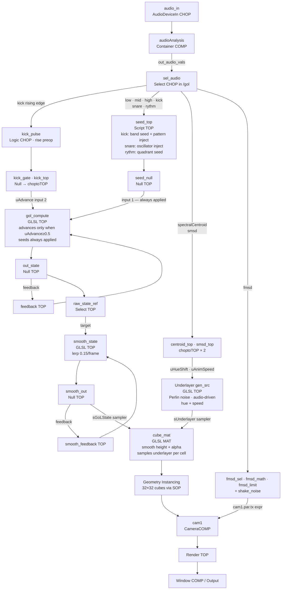

# Requirements — Audio-Reactive Game of Life

**Date**: 2026-05-24 (last updated 2026-05-26)  
**Context**: TouchDesigner live-performance visual system

---

## 1. Project Summary

A 32×32 grid of 3D cubes simulates Conway's Game of Life in real time. The simulation is seeded and perturbed by live audio analysis. Alive cells are tall and opaque, masking an underlayer of visuals; dead cells are flat and semi-transparent, letting the underlayer show through slightly. The system is designed for live VJ / performance use on a single display.

---

## 2. Audio Input

- **Source**: Microphone or line-in via physical audio interface
- **Operator**: `Audio Device In CHOP` (`audio_in` in `/audio`)
- No loopback or virtual audio required at this stage

---

## 3. Audio Analysis

All audio analysis is handled by the **`audioAnalysis` container component** (Xavier Tremblay / Matthew Ragan / Greg Hermanovic, v6) inside `/audio`. The hand-built FFT/filter/analyze chain has been replaced by this component.

### 3.1 Frequency Band Splitting

The audio signal is split into three frequency bands. Each band's processed energy level is extracted per frame.

| Channel | Frequency Range | Filter Type |
|---|---|---|
| `low` | 0 – 180 Hz | Lowpass @ 180 Hz |
| `mid` | ~180 – 3500 Hz | Bandpass @ 800 Hz |
| `high` | 3500 Hz+ | Highpass @ 3500 Hz |

- Gain, smoothing, and threshold controls live inside the `audioAnalysis` component per band.

### 3.2 Kick / Transient Detection

Kick drum hits are detected inside `audioAnalysis` via threshold-based onset detection.

- **Channel**: `kick` — fires as a 0 → 1 pulse on each kick hit
- In `/gol`, a **Logic CHOP** (`kick_pulse`, `preop = rise`) converts the kick envelope into a guaranteed single-frame rising-edge pulse
- Kick events gate both GoL generation advancement and cell seeding (see Section 5)

### 3.3 Additional Channels (available, not yet mapped)

`audioAnalysis` also outputs: `snare`, `rythm`, `fmsd`, `smsd`, `spectralCentroid`. See `documentation/audio-mapping.md` for full descriptions and suggested uses.

### 3.4 Output

`audio_in` → `audioAnalysis` → `out_audio_vals` (Null CHOP)

`out_audio_vals` is the single output of `/audio`, consumed by `/gol/sel_audio`.

---

## 4. Game of Life Simulation

### 4.1 Grid

- **Size**: 32×32 cells (1024 cells total), configurable via parameter
- Each cell has two states: **alive** (1) or **dead** (0)
- Cell state is stored as a 32×32 pixel texture (RGBA32Float)

### 4.2 Simulation Rules (Conway's GoL)

Standard rules apply each generation:
1. Any alive cell with 2 or 3 alive neighbours survives
2. Any dead cell with exactly 3 alive neighbours becomes alive
3. All other cells die or remain dead

### 4.3 Implementation

- **Approach**: GLSL pixel shader in a `GLSL TOP` — one pixel = one cell
- Current state texture feeds back into itself each generation via a `Feedback TOP`
- **Generation tick rate**: **Kick-gated** — the simulation advances exactly one generation per kick hit. Between kicks the grid is completely frozen.
- The pixel shader reads `uAdvance` from a 1×1 `choptoTOP` (driven by `kick_gate` Null CHOP). When `uAdvance < 0.5` the shader passes the current state through unchanged.

### 4.4 Initial State / Reset

- Grid initialises with a random sparse pattern (configurable density)
- Reset can be triggered manually

---

## 5. Audio → Simulation Mapping

The seed texture is always applied to the GoL state regardless of whether the grid is advancing. This allows `snare` and `rythm` to inject alive cells into a frozen grid — those cells persist and evolve when the next kick fires.

### 5.1 Kick → Band Seeding + Pattern Injection + Generation Advance

On each kick rising edge, three things happen simultaneously:

1. **Band seeding** — random alive cells injected proportional to band energy:

| Band | Channel | Max cells/kick at energy=1.0 |
|------|---------|------------------------------|
| Bass | `low` | 20 |
| Mid | `mid` | 12 |
| Treble | `high` | 8 |

2. **Pattern injection** — a structured GoL pattern stamped at a random grid position, drawn from the pattern library via category rotation (spaceship → oscillator → methuselah → …). Count configurable via `patterns_per_beat` (default 2).

3. **Generation advance** — GoL rules applied for one generation (the only trigger that advances the simulation).

### 5.2 Snare → Oscillator Pattern Injection

On each snare rising edge (independent of kick):

- One pattern from the **oscillator** category is stamped at a random grid position
- Fires whether or not the grid is currently frozen
- Cells persist in the frozen state and evolve on the next kick

### 5.3 Rythm → Quadrant Seeding

On each rythm rising edge (independent of kick):

- A random 16×16 quadrant of the grid (one of four corners) is seeded at **~50% density**
- Creates a dense burst of alive cells in one region of the grid
- Fires whether or not the grid is currently frozen

### 5.4 Pattern Library

Eight canonical GoL patterns are encoded as cell-coordinate offsets in a `pattern_library` Table DAT:

| Category | Patterns |
|----------|----------|
| Spaceship | Glider, LWSS |
| Oscillator | Blinker, Toad, Beacon, Pulsar |
| Methuselah | R-pentomino, Acorn |

### 5.5 Dead-Grid Recovery

**Removed.** The grid is intentionally frozen between kicks — a frozen grid is not a dead grid. If the grid dies during a live session, the next kick will inject a pattern via the beat-triggered pattern injection (§5.1).

---

## 6. Visuals

### 6.1 Cube Grid

- **1024 cubes** rendered via geometry instancing (SOP + Instance CHOP)
- Each cube maps to one cell in the 32×32 grid
- Grid is laid out flat on the XZ plane, cubes extend upward on Y

### 6.2 Cell State → Cube Appearance

| State | Height (Y scale) | Opacity / Alpha |
|-------|-----------------|-----------------|
| Alive | Full height (1.0) | Fully opaque — shows underlayer colour sampled at that cell's grid UV |
| Dead  | Flat / sunken (0.05) | Fully invisible (alpha = 0) |

- Height values are parameters via `uDeadHeight` uniform on `cube_mat` (default 0.05)
- **Transitions between states are smoothly animated** via a per-frame lerp on the state texture (see §6.4)
- Alpha in the pixel shader uses `vAlive` directly (0.0 → 1.0), not a hard step

### 6.3 Audio → Height Modulation

Not implemented. Alive cube height is uniform (1.0); only the count of alive cells changes with audio energy.

### 6.5 Audio → Camera Shake

`fmsd` (Fast Moving Standard Deviation) drives X-axis jitter on `cam1`:

- CHOP chain: `fmsd_sel` → `fmsd_math` (abs × 0.2) → `fmsd_limit` (clamp 0–0.5)
- `cam1.par.tx` expression: magnitude × `shake_noise` (Noise CHOP at 20 Hz) for random directional shake
- Spikes on transients and attacks, idle near zero in silence

### 6.4 Smooth State Rendering

A lerp feedback loop in `/render` produces a smoothed version of the GoL state texture, used by the cube material instead of the raw binary state:

```
raw_state_ref (Select TOP → /gol/out_state)
    ↓ (input 1 — target)
smooth_feedback (Feedback TOP) → smooth_state (GLSL TOP) → smooth_out (Null TOP)
    ↑                               mix(current, target, 0.15)
    └───────────────────────────────────────────────────────┘
```

- `uLerpSpeed = 0.15` (tunable vec uniform on `smooth_state`) — ~0.3 s transition at 60 fps
- `cube_mat.sampler0top` and `gol_state_ref` both reference `smooth_out`
- `raw_state_ref` always points to the raw binary `/gol/out_state` (GoL simulation loop is unaffected)

---

## 7. Underlayer (Masked Background)

### 7.1 Purpose

The underlayer is a visual that sits "behind" the cube grid. Alive cells mask it fully (the cube face covers it), dead cells reveal it partially (semi-transparent cube lets the underlayer bleed through).

### 7.2 Sources (switchable at runtime)

| Mode | Description |
|------|-------------|
| **Video / Media** | `Movie File In TOP` — plays back a video clip or image |
| **Generative** | `GLSL TOP` — procedural shader (noise, fluid simulation, etc.) |

- Switching between modes happens via a `Switch TOP` controlled by a parameter
- Both sources should be hot-swappable without interrupting the simulation

### 7.3 Masking Mechanic

The underlayer is **embedded inside the cube material** (GLSL MAT), not composited as a separate layer:

- Each cube samples the underlayer texture at its own grid-cell UV in the vertex shader
- Alive cubes render that underlayer colour at full opacity
- Dead cubes are fully invisible (alpha = 0) — the underlayer is not visible through them
- No `Over TOP` or `Composite TOP` is used; `/composite` simply passes through the cube render

**Note**: this differs from the original design intent (semi-transparent dead cubes revealing a separate underlayer). The implemented approach makes the underlayer appear only on alive cube faces — the grid background is fully black.

### 7.4 Audio → Underlayer Colour

Two audio channels drive the Perlin noise colour field in `gen_src` (GLSL TOP) via 1×1 `choptoTOP` textures wired as shader inputs:

| Channel | Uniform | Effect |
|---|---|---|
| `spectralCentroid` | `uHueShift` (× 0.5) | Shifts the base hue of the colour field — bright/trebly audio rotates colour toward warm end |
| `smsd` | `uAnimSpeed` (abs × 0.15, clamped 0.02–0.3) | Controls auto-rotation speed of the hue — high energy variance accelerates colour cycling |

---

## 8. Rendering Pipeline



---

## 9. Performance Requirements

- Target: stable 60 FPS on a standard performance laptop/desktop
- GLSL compute for GoL avoids CPU bottleneck
- Geometry instancing avoids per-instance COMP overhead
- All heavy operations (GoL compute, smooth lerp) happen on GPU where possible

---

## 10. Network Component Structure (TouchDesigner)

| Base COMP | Contents |
|-----------|----------|
| `/audio`  | `audio_in` (AudioDeviceIn), `audioAnalysis` container, `out_audio_vals` null |
| `/gol`    | GoL GLSL compute + feedback, seed Script TOP, kick pulse CHOP chain (`kick_sel` → `kick_pulse` → `kick_gate` → `kick_top`) |
| `/render` | Instanced cube geometry, `cam1` (shake driven by `fmsd`), light, `cube_mat` GLSL MAT, smooth state lerp chain (`raw_state_ref` → `smooth_state` → `smooth_out`), camera shake chain (`fmsd_sel` → `fmsd_math` → `fmsd_limit` + `shake_noise`) |
| `/underlayer` | Switch TOP, Movie File In, `gen_src` GLSL TOP (Perlin noise with `spectralCentroid` hue + `smsd` speed via `centroid_top` / `smsd_top`) |
| `/composite` | Final compositing of render + underlayer |
| `/output` | Window COMP, resolution settings |

---

## 11. Open Questions / TBD

- [x] Generation tick rate: **Kick-gated** — simulation advances exactly one generation per kick hit. Grid is frozen between kicks.
- [x] Cube state transition smoothing: **Smooth lerp** — `smooth_state` GLSL TOP interpolates toward the raw GoL state at `uLerpSpeed = 0.15` per frame (~0.3 s transition at 60 fps).
- [x] Exact beat response behavior: **Kick** = band seeding + category-rotating pattern injection + generation advance. **Snare** = oscillator pattern inject. **Rythm** = quadrant seed burst. All independent triggers.
- [x] Audio → height modulation for alive cells: **Not implemented.** All alive cubes are uniform height 1.0.
- [x] Underlayer generative shader: **Animated Perlin noise field** with `spectralCentroid`-driven hue offset and `smsd`-driven rotation speed. Placeholder — user can replace.
- [x] Lighting model for cubes: **Custom GLSL MAT** — effectively unlit. No Phong/PBR; colour comes from underlayer texture sampled per cell.
- [x] Dead-grid recovery: **Removed** — grid is intentionally frozen between kicks, not dead.
- [x] Camera shake: **`fmsd`-driven X-axis jitter** on `cam1` — magnitude proportional to fast transient energy, direction randomised by Noise CHOP.
- [x] Underlayer colour modulation: **`spectralCentroid` → hue shift, `smsd` → animation speed** — both wired via choptoTOP textures into `gen_src` shader.
